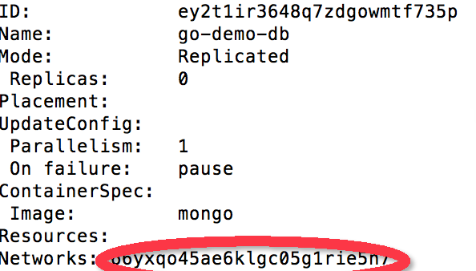
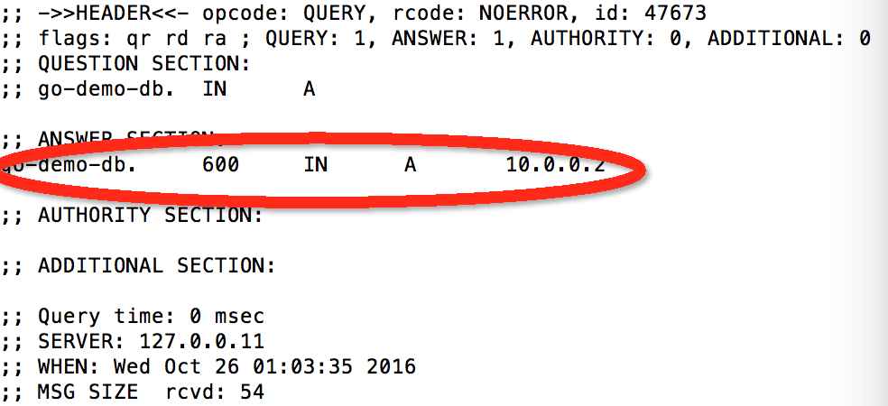
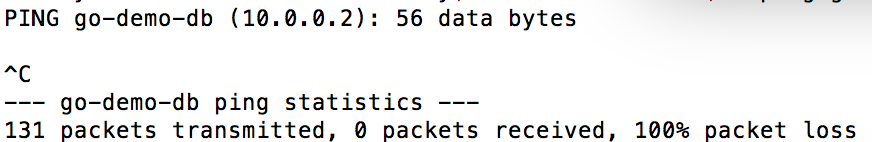
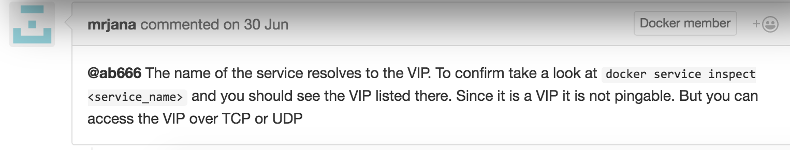
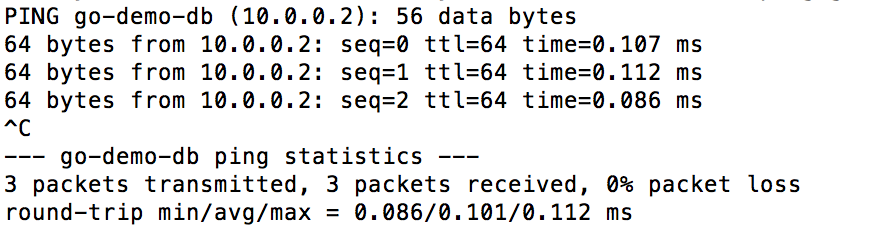
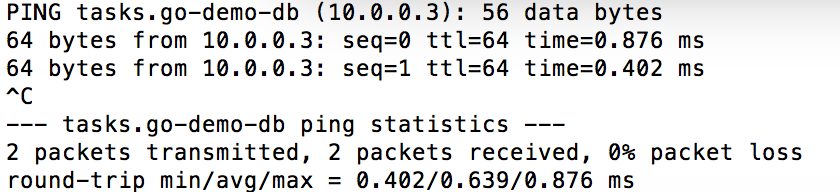
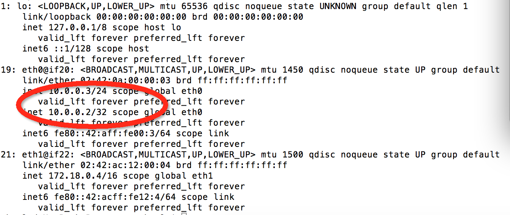
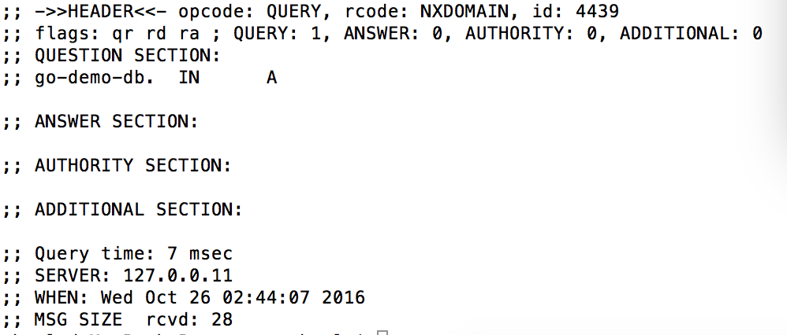

## 前言 ##

最近正在学习Docker Swarm集群架构，学习过程中的心得体会记录下来以备将来查阅。

传统的集群网络通讯方式是建立一个代理服务（proxy）作为中心点，所有的服务之间的通讯都是基于这个代理来实现。当有新的服务添加或者旧的服务去除的时候，就需要去修改代理的配置，虽然很容易实现，但是维护工作比较琐碎。

Docker的集群可以简化这些操作，可以在Docker Swarm集群上创建若干个网络链(overlay network)，只有挂载在同一个链上的service（服务）互相之间才能通信。Docker可以为每个service在不同的实体机上创建若干个实例，并通过routing mesh来实现负载均衡、分发请求到具体的service实例上。当我们需要访问集群上的某个service时，只需要将请求发送到集群的任何一个节点上就可以，Docker的网络会将我们的请求转发到该service的某个实例上，我们不需要知道这个实例具体运行在集群的哪个节点上。

Docker Swarm的service（服务）连上网络后拥有自己的IP，不是实例的IP，是service的独立IP。为什么service会有IP，Docker Swarm的network上的service之间是怎么互相通信的，service和他的实例之间又是怎样的关系，为了解决这些疑问，我们建立了一个测试集群，实际检测一下。

## 准备工作 ##

服务器：mac pro
运行环境：boot2docker虚拟环境

首先用docker-machine创建3个虚拟节点。

	for i in 1 2 3;do
		docker-machine create -d virtualbox node-$i
	done

切换到第一个节点

	eval $(docker-machine env node-1)

创建swarm集群

	docker swarm init \
		--advertise-addr $(docker-machine ip node-1)
		
切换到其他节点，加入集群

	TOKEN=$(docker swarm join-token -q worker) 
	for i in 2 3;do
		eval $(docker-machine env node-$i)
		docker swarm join \
			--token $TOKEN \
			--advertise-addr $(docker-machine ip node-$i) \ $(docker-machine ip node-1):2377
	done
	
切换到主节点，查看集群
	
	eval $(docker-machine env node-1)
	
	docker node ls
	
你看到的集群状态大概是这样的

接下来我们建立一个网络链，

	docker network create --driver overlay go-demo
	
然后创建一个挂接到这个网络上的一个service

	docker service create --name go-demo-db \
	 	--network go-demo \
		mongo

查看一下这个service的状态

	docker service inspect --pretty go-demo-db
	
可以看到这个service已经连接上我们之前创建的网络了

红色的网络ID就是之前创建的网络的ID

现在我们要验证一下同一个网络环境下对service的访问

首先创建一个基于最小Linux环境alpine的service，为了验证不同节点对我们测试service go-demo-db的连接情况，我们希望这个service可以在集群的每个节点上都运行一个实例，所以我们加了一个参数--mode global

	docker service create --name util \
	 	--network go-demo --mode global \
	 	 alpine sleep 1000000000
	 	 
验证一下
	
	docker service ps util

可以看到

每个节点都运行了一个util的实例，再在每个实例上安装一个小程序drill，用来

	ID=$(docker ps -q --filter label=com.docker.swarm.service.name=util)
	docker exec -it $ID apk add --update drill
	
接着验证一下网络是否通畅，service是否有自己的虚拟IP：

	docker exec -it $ID drill go-demo-db

可以看到

网络是通的，service的IP也能获取到，但是这是service的IP还是实例的IP呢？还需要进一步验证，先ping一下
	
	docker exec -it $ID ping go-demo-db

结果是ping不通，这就奇怪了。既然网络是通的应该也能ping通才对啊。网上找找是否有其他资料，找到了Docker上的一个issue，报的似乎是同一个问题

[https://github.com/docker/docker/issues/23855](https://github.com/docker/docker/issues/23855)

结论是service IP是虚拟IP，虚拟IP可以接受TCP或者UDP协议，但是是无法PING的

真的这样吗？docker ps了一下，go-demo-db的实例不在这个节点上。如果他们在一个节点上会怎样？切换到有go-demo-db实例的节点上，再次PING

	 eval $(docker-machine env node-2)
	 ID=$(docker ps -q --filter label=com.docker.swarm.service.name=util)
	 docker exec -it $ID ping go-demo-db

这次PING通了。好吧，虚拟IP也是可以PING通的。切换到其他节点，PING一下service的实例试试看

	eval $(docker-machine env node-1)
	ID=$(docker ps -q --filter label=com.docker.swarm.service.name=util)
	docker exec -it $ID ping tasks.go-demo-db
	

结果顺利的PING通了，注意这个IP不再是service的IP，而是实例的IP了。具体再看下go-demo-db的IP

	eval $(docker-machine env node-2)
	ID=$(docker ps -q --filter label=com.docker.swarm.service.name=go-demo-db)
	docker exec -it $ID ip addr
	
结果

这个service的虚拟IP其实是附着在实例上的，如果我把所有实例关了呢

	eval $(docker-machine env node-1)
	docker service scale go-demo-db=0
	ID=$(docker ps -q --filter label=com.docker.swarm.service.name=util)
	docker exec -it $ID drill go-demo-db

结果

这次是找不到这个service了。

## 总结

Docker Swarm的service挂到一条网络链上后都会产生一个虚拟IP，这个虚拟IP是附着在service的实例上的。当我们需要service提供服务的时候，只需要通过service name来发起请求，service提供了load balance和routing mesh的功能，可以帮我们找到最适合的实例来提供我们需要的服务。service的load balance和routing mesh功能对TCP和UDP协议运行良好，对ICMP协议如果同一个节点上没有这个service的实例存在的话是不可达的。

Docker Swarm的网络形态还是很好用的。传统的服务器网络服务都部署在同一个局域网，互相之间都可以访问得到，想隔离的话就得增加硬件设施，增加成本。而在Docker Swarm，如果有个服务有3个服务需要访问，切三个服务互相之间是要隔离的，那么只需要创建3条网络链，需要连通的服务挂在同一条网络链上即可，简单方便。

## 参考资料

Viktor Farcic：《The DevOps 2.1 Toolkit: Docker Swarm》